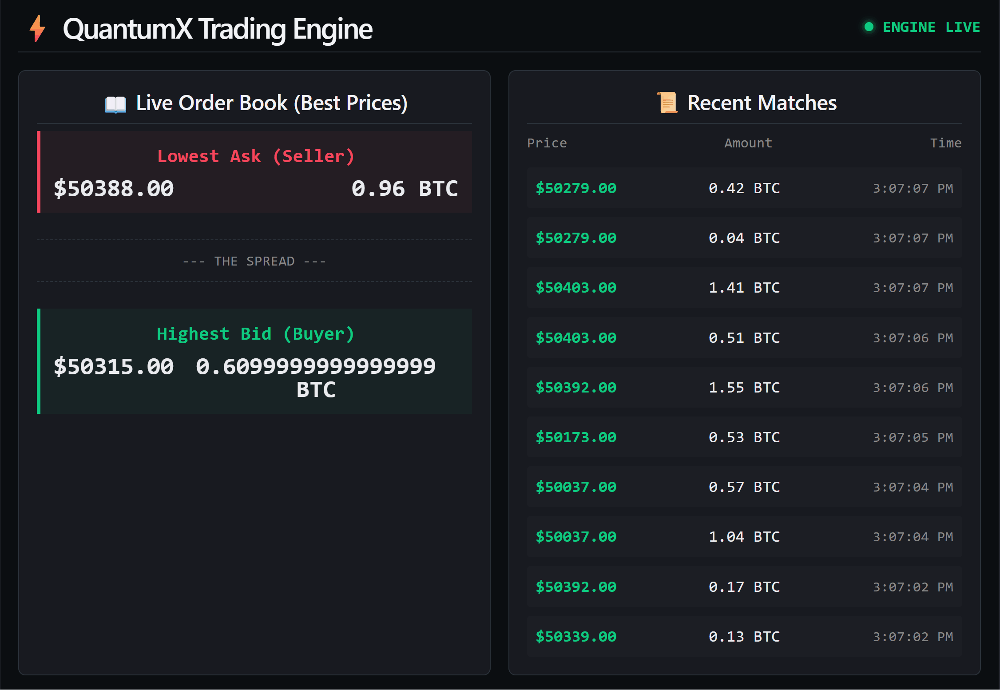

QuantumX Trading Engine

QuantumX is a full-stack, real-time algorithmic trading engine built to simulate high-frequency matching environments. It processes concurrent buy and sell orders, maintains a live order book, and executes trades the millisecond bids and asks cross.

